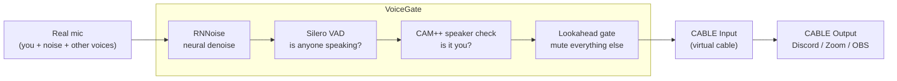

<div align="center">

# VoiceGate

**A noise suppressor that only lets *your* voice through.**

VoiceGate learns your voiceprint and blocks everything that isn't you: keyboards, traffic,
music, the TV, and other people talking in the room. It feeds a virtual microphone, so it
works in Discord, Zoom, OBS, Teams, and games without per-app setup.

[](https://github.com/hnalpha323/VoiceGate/actions/workflows/ci.yml)
[](LICENSE)
[](https://dotnet.microsoft.com/download)
[](#requirements)

</div>

---

## Why this exists

Mainstream noise suppressors (Discord's Krisp, NVIDIA Broadcast, RTX Voice) are trained to remove
*non-speech* noise. They do that well, but they can't help with the thing that actually derails a
call: your roommate, your family, the TV, or someone on the phone in the next room. To a speech
denoiser, a human voice is signal, not noise.

VoiceGate closes that gap. You enroll your voice once, and it then verifies every moment of audio
against that voiceprint in real time. If the voice isn't yours, the gate stays shut and the people
on the call hear nothing.



## Features

- **Speaker verification, not just denoising.** A CAM++ speaker embedding (your compact voiceprint)
  decides whether speech is yours, so background *voices* are gated out, not only background *noise*.
- **Neural noise suppression.** RNNoise runs first, so the gate and the voiceprint work on clean audio.
- **Three gate modes:** VAD only, Balanced (fast, recommended), and Strict (nothing unverified passes).
- **Lookahead gate** that opens before your first syllable, so nothing gets clipped.
- **Works with every app.** Output goes to a virtual microphone rather than into one program.
- **Local and private.** No cloud, no telemetry, no audio leaves your machine. Only a compact
  voiceprint is stored, never a recording.
- **Optional exclusive mic mode** so no other app can read the raw, unfiltered microphone.
- **Low latency:** roughly 30 ms of processing plus your configurable lookahead (120 ms by default).

## Requirements

| Requirement | Notes |
|---|---|
| Windows 10 or 11, x64 | Uses WASAPI |
| [.NET 9 Desktop Runtime](https://dotnet.microsoft.com/download/dotnet/9.0) | Not needed if you build with `-SelfContained` |
| [VB-Audio Virtual Cable](https://vb-audio.com/Cable/) | Free/donationware; creates the virtual microphone |
| ~29 MB of models | Downloaded once from the [sherpa-onnx](https://github.com/k2-fsa/sherpa-onnx) releases |

## Quick start

### 1. Install the virtual cable

Download [VB-Audio Virtual Cable](https://vb-audio.com/Cable/), extract the zip, right-click
`VBCABLE_Setup_x64.exe`, choose **Run as administrator**, install the driver, then **reboot**.

This creates two endpoints that VoiceGate and your apps use as a pipe:

- `CABLE Input` (a playback device): VoiceGate writes your clean voice here.
- `CABLE Output` (a recording device): Discord and other apps listen here.

### 2. Build and run VoiceGate

```powershell
git clone https://github.com/hnalpha323/VoiceGate.git
cd VoiceGate
./publish.ps1              # add -SelfContained if the PC has no .NET 9 runtime
./dist/VoiceGate.exe
```

### 3. Download the models and enroll your voice

In the app:

1. Click **Download models**. This is a one-time ~29 MB download from the sherpa-onnx GitHub releases.
2. Click **Enroll my voice** and read the on-screen paragraph aloud for about 25 seconds, in your
   normal voice, at your normal distance from the mic, in the room where you normally talk. VoiceGate
   suggests a match threshold based on how consistent your voiceprint turned out.
3. Confirm that **Microphone** is your real mic and **Send clean audio to** is
   `CABLE Input (VB-Audio Virtual Cable)` (selected automatically when present).
4. Click **Start**.

### 4. Point your apps at the virtual mic

In Discord, go to Settings > **Voice & Video** > *Input Device* and choose
**CABLE Output (VB-Audio Virtual Cable)**. Then turn off Discord's own *Noise Suppression* (Krisp)
and *Automatic Gain Control*, since they interfere with the gate and double-processing hurts quality.

Every other app works the same way (Zoom, Teams, OBS, Slack, games): pick **CABLE Output** as the
microphone. You can also click **Make virtual mic the Windows default** in VoiceGate so any app that
follows the system default picks it up automatically.

## Using it

### Gate modes

| Mode | What it does | Best for |
|---|---|---|
| **VAD only** | Passes any speech, blocks non-speech noise. No speaker check. | You're always alone in the room |
| **Balanced** *(default)* | Opens instantly on speech, then closes about 0.3 to 0.6 s after it detects the voice isn't yours. | Normal use, no clipped syllables |
| **Strict** | Stays shut until the voice is confirmed to be yours. Nothing unverified leaks. | Noisy households, TV or radio in the background, shared offices |

Balanced trades a little leakage for speed: it lets a fraction of a second of someone else's voice
through before cutting them off. Strict leaks nothing but needs about 0.3 s of your speech before it
opens; raising **Lookahead** to 200 to 300 ms hides that delay.

### The settings that matter

| Setting | What it does | Tuning advice |
|---|---|---|
| **Voice match threshold** | How similar to your voiceprint audio must be to pass. | Watch the live *Voice match* meter while you and someone else talk, then set it between the two scores. Raise it if others leak through; lower it if you get cut off. |
| **Noise reduction (dB)** | Suppression strength of the denoiser. | 18 dB is a good default. Too high sounds robotic or underwater. |
| **Gate release (ms)** | How fast the gate closes after you stop talking. | 120 ms feels natural. Shorter is choppier, longer keeps more room tone. |
| **Lookahead (ms)** | Delays the audio so the gate can open before your first syllable. | 120 ms default, 200 to 300 ms in Strict mode. It costs exactly that much latency. |
| **Take exclusive control of the mic** | Locks the physical mic so no other app can read the raw signal while VoiceGate runs. | Turn on if you never want an app to bypass VoiceGate. Not every device supports it; the app falls back to shared mode and tells you. |
| **Monitor (hear the result)** | Plays the processed output on your speakers. | Turn on while tuning, off during calls (use headphones or you'll get feedback). |

### Reading the live panel

- **Mic in:** raw level from the microphone.
- **Clean out:** what actually reaches the virtual mic. Should be silent when you aren't talking.
- **Voice match:** live cosine similarity against your voiceprint. Green means above the threshold.
- **Gate OPEN / closed** and **Speech detected:** the two decisions, live.
- **Output buffer:** pipeline backlog. It should stay under about 100 ms; a growing number means the
  CPU can't keep up.

## Troubleshooting

<details>
<summary><b>There's no "CABLE Input" device in the dropdown</b></summary>

VB-Cable isn't installed, or you haven't rebooted since installing it. The banner in the app links to
the installer, which must be run as administrator.
</details>

<details>
<summary><b>Discord hears nothing at all</b></summary>

1. Is VoiceGate running? The button reads "Stop", and the gate light turns green when you talk.
2. Is Discord's input **CABLE Output**, not CABLE *Input*? Input is where VoiceGate writes; Output is
   where apps listen.
3. Are you in Strict mode without an enrolled voiceprint? Then the gate never opens by design. Enroll,
   or switch to Balanced.
4. Check the **Clean out** meter. If it moves while you speak, VoiceGate is fine and the problem is
   downstream in the app.
</details>

<details>
<summary><b>My own voice gets cut off, or the first word is clipped</b></summary>

Lower the **Voice match threshold** slightly, raise **Lookahead**, or switch from Strict to Balanced.
If your score sits stubbornly low, re-enroll in the room you actually use. Enrolling on a headset and
then talking into a laptop mic across the room is a genuinely different-sounding voice.
</details>

<details>
<summary><b>Another person's voice leaks through for a moment</b></summary>

That's Balanced mode working as designed: it opens on speech, then verifies. Switch to Strict for zero
leakage, and raise Lookahead to compensate for the slower opening.
</details>

<details>
<summary><b>The audio sounds robotic or over-processed</b></summary>

Lower **Noise reduction (dB)**, and make sure the app on the other end isn't also denoising (turn off
Discord's Krisp or Zoom's background suppression).
</details>

<details>
<summary><b>"Exclusive mic mode not supported by this device"</b></summary>

Your audio driver doesn't allow exclusive capture in any of the formats VoiceGate probes. This is
harmless: it falls back to shared mode automatically. Everything still works; other apps could just
open the raw mic if they wanted to.
</details>

<details>
<summary><b>Latency feels high</b></summary>

Reduce **Lookahead**, which accounts for nearly all of it. The rest of the pipeline adds about 10 to
30 ms. Also check that the *output buffer* reading stays under about 100 ms.
</details>

## How it works

Audio flows through five stages, all on your machine:

1. **Capture.** WASAPI grabs the mic at its native rate, downmixes to mono, and resamples to 48 kHz.
2. **Denoise.** [RNNoise](https://github.com/xiph/rnnoise), a small recurrent neural network, removes
   non-speech noise. A spectral Wiener-filter denoiser is the fallback if the native library can't load.
3. **Detect.** A 16 kHz side-chain runs [Silero VAD](https://github.com/snakers4/silero-vad) to answer
   "is anyone speaking right now?"
4. **Verify.** While speech is present, a rolling window is fed to a
   [CAM++](https://github.com/modelscope/3D-Speaker) speaker-embedding model every ~250 ms. The
   resulting embedding vector is compared to your enrolled voiceprint by cosine similarity.
5. **Gate.** A lookahead-delayed gate with hysteresis, hold, and smooth attack/release opens only when
   the VAD and (depending on mode) the speaker check agree. The result is written to the virtual cable.

For the threading model, latency budget, and the reasoning behind these choices, see
[docs/ARCHITECTURE.md](docs/ARCHITECTURE.md).

## Building from source

```powershell
git clone https://github.com/hnalpha323/VoiceGate.git
cd VoiceGate

dotnet build                 # compile
dotnet test                  # run the DSP and pipeline test suite
./publish.ps1                # produce dist\VoiceGate.exe (framework-dependent)
./publish.ps1 -SelfContained # bundle the .NET runtime too (~150 MB, no prerequisites)
```

You need the [.NET 9 SDK](https://dotnet.microsoft.com/download/dotnet/9.0). Everything else, including
the native binaries, comes from NuGet.

The models are not stored in the repo. They're downloaded at runtime into
`%APPDATA%\VoiceGate\models`, either by the in-app button or by `./setup-models.ps1`.

### Reusing the core (.NET Standard 2.0)

VoiceGate itself is a WPF app, so the executable is Windows-only by nature. The interesting half
isn't: `src/VoiceGate.Core` targets **.NET Standard 2.0** as well as .NET 9, so the DSP, Silero VAD,
speaker verification, and model management can be referenced from .NET Framework 4.6.1+, Mono, Unity,
Xamarin, or a cross-platform .NET app.

```xml
<ProjectReference Include="path/to/src/VoiceGate.Core/VoiceGate.Core.csproj" />
```

```csharp
using VoiceGate.Dsp;
using VoiceGate.Speech;

IDenoiser denoiser = new SpectralDenoiser { ReductionDb = 18f };
denoiser.Process(frame);                    // 48 kHz mono float, in place

using var verifier = new SpeakerVerifier("speaker.onnx");
float[] me = verifier.ComputeEmbedding(enrollmentSamples16k);
float score = SpeakerVerifier.Cosine(me, verifier.ComputeEmbedding(liveSamples16k));
```

Audio I/O is deliberately not in the core: `AudioEngine` and the device plumbing are WASAPI-bound and
stay in the Windows app, so bring your own capture on other platforms. The underlying sherpa-onnx and
RNNoise packages ship native binaries for Linux and macOS as well as Windows.

## Contributing

Contributions are welcome, especially real-world tuning feedback, device compatibility reports, and
better speaker-verification models. See [CONTRIBUTING.md](CONTRIBUTING.md) for the workflow, coding
style, and a list of good first issues.

## Privacy

VoiceGate runs entirely offline. There is no telemetry, no account, and no network access except the
one-time model download from GitHub. Your enrollment recording is processed in memory and discarded;
only the derived voiceprint (a compact vector of floats in `%APPDATA%\VoiceGate\profile.json`) is
saved, and speech cannot be reconstructed from it.

## Built on

VoiceGate is a small shell around several open-source projects:

| Project | Role | License |
|---|---|---|
| [sherpa-onnx](https://github.com/k2-fsa/sherpa-onnx) | Silero VAD and speaker-embedding runtime | Apache-2.0 |
| [Silero VAD](https://github.com/snakers4/silero-vad) | Voice activity detection model | MIT |
| [3D-Speaker CAM++](https://github.com/modelscope/3D-Speaker) | Speaker verification model | Apache-2.0 |
| [RNNoise](https://github.com/xiph/rnnoise) / [RNNoise.Net](https://github.com/Yellow-Dog-Man/RNNoise.Net) | Neural noise suppression | BSD-3 / MIT |
| [NAudio](https://github.com/naudio/NAudio) | WASAPI capture/render and resampling | MIT |
| [VB-Audio Virtual Cable](https://vb-audio.com/Cable/) | The virtual microphone (installed separately) | Donationware |

## License

[MIT](LICENSE).
